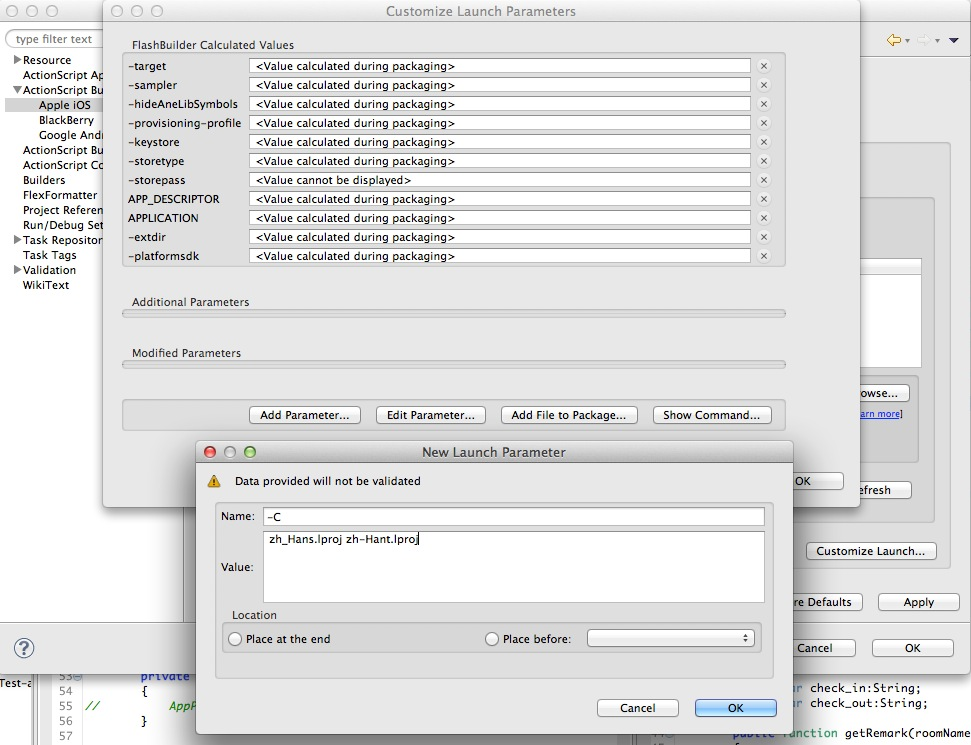

ANE-UMengSocial
===============

Android 版本更完善的ANE： https://github.com/platformanes/UmengSocialANE

新增分享到微信，在init方法里传入微信的ID和URL就行了

新增第三方账号登陆功能，该功能暂时仅支持iOS平台，可以只下载IOS.ane使用

```actionscript
UMSocial.instance.cancelLogin('sina', function(result:String):void{
	//取消授权，返回{}则表示成功
}); 
//切忌不能连续调用两次该方法，否则会报错
UMSocial.instance.login('sina', function(result:String){
	//登陆获取授权，返回如下对象，如果已经授权过则直接返回该对象
{
    accessToken = "2.00twwPQC03t9ZI6ef9cf7509eaFhTB";
    iconURL = "http://tp4.sinaimg.cn/2072488563/180/40012495145/1";
    platformName = sina;
    profileURL = "http://www.weibo.com/u/2072488563";
    userName = "\U6298\U7ffc\U4f34\U4f60\U884c";
    usid = 2072488563;
{
   
});

```

目前支持的功能:

- 直接弹出分享框分享，支持多平台（Android版仅支持分享到新浪微博）
- 控制评论、分享、喜欢、个人中心的工具条显示或隐藏，并可通过工具条分享到微博、QQ空间、腾讯微博和邮件，还可以评论和喜欢

Android版本需要在配置里加入如下权限信息方可使用：

```
		<application ……>
			……
		<activity ……/>
		<meta-data android:value="YOUR_APP_KEY" android:name="UMENG_APPKEY"></meta-data>
		<meta-data android:value="Channel ID" android:name="UMENG_CHANNEL"/>
		</application>
		<uses-permission android:name="android.permission.ACCESS_NETWORK_STATE"></uses-permission>
		<uses-permission android:name="android.permission.INTERNET"></uses-permission>
		<uses-permission android:name="android.permission.READ_PHONE_STATE"></uses-permission>
		<uses-permission android:name="android.permission.READ_LOGS"></uses-permission>
```


功能不完善，API文档和Demo稍后再补充

编译时为了使用中文，需要在项目的Properties面板->ActionScript Build Packaging->Apple iOS面板里，点击右下角的Customize Launch Parameters按钮，添加一个新的编译参数-C zh_Hans.lproj zh-Hant.lproj，将语言文件打包到项目文件里，语言文件包在demo文件夹下


Demo : Main.as

```actionscript
function Main()
{
	UMSocial.instance.init('UMENG_KEY', false); //默认不初始化底部控制条
	UMSocial.instance.share('ID', '文本', '图片', '标题', 'sina');
	
	//由于底部控制条初始化可能消耗一定性能，所以默认初始化了后，需要调用让其显示的方法才能显示出来
	//UMSocial.instance.status(true);
	
	//控制条显示后，需要动态切换控制条对应的内容，则通过该方法进行更新，控制条的分享、评论、喜欢等都于ID紧密关联
	//UMSocial.instance.dataID('ID', '文本', '图像', '标题');
}

```
